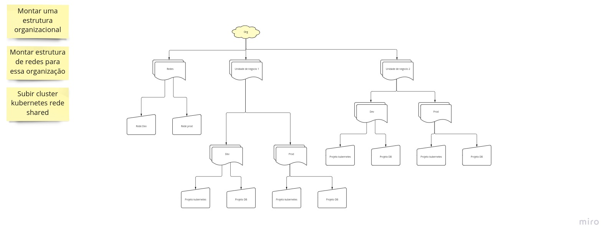

# Exercicio-bootcamp
Exercicio terraform Bootcamp

## Objetivos

#### Fase 1 Montar estrutura organizacional baseado no desenho de arquitetura abaixo

#### Fase 2 Montar estrutura de redes baseado na arquitetura
#### Fase 3 Montar Cluster kubernetes utilizando rede shared
